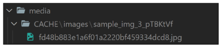

# image resizing

- 원본 이미지를 서버에 그대로 로드하는 것은 여러 이유로 부담이 큼
- HTML img 태그에서 직접 사이즈를 조정할 수 있지만
    - 업로드 될 때 `이미지 자체를 resizing하는 것을 사용`해 볼 것
    

## 사전 준비

- django-imagelit 모듈 설치 및 등록
- `pip install django-imagekit`
    - 이미지 처리를 위한 django 앱
    - 썸네일, 해상도, 사이즈, 색깔 등을 조정할 수 있음
- settings.py에 INSTALLED_APPS에 추가

## 1. 썸네일 만들기

- 2가지 방식으로 썸네일 만들기 진행
    1. 원본 이미지 저장 X
    2. 원본 이미지 저장 O


### 1.1 원본 이미지 저장 X

```python
from imagekit.processors import Thumbnail
from imagekit.models import ProcessedImageField

def articles_image_path(instance, filename):
    return f'images/{instance.user.username}/{filename}'

# Create your models here.
class Article(models.Model):
...
    # image = models.ImageField(blank=True, upload_to='%Y/%m/%d/')
    # image = models.ImageField(blank=True, upload_to='images/')
    # image = models.ImageField(blank=True)
    # image = models.ImageField(blank=True, upload_to=articles_image_path)
    image = ProcessedImageField(
        blank=True,
        upload_to='Thumbnails/',
        processors = [Thumbnail(200,300)],
        format = 'JPEG',
        options={'quality':80}
    )
...
```
- 이미지를 잘라서 저장
- processors 작성하는 여러 클래스는 해당 라이브러리 문서를 별도로 확인
- https://github.com/matthewwithanm/pilkit

### 1.2 원본 이미지 저장 O

```python
from imagekit.processors import Thumbnail
from imagekit.models import ProcessedImageField, ImageSpecField

def articles_image_path(instance, filename):
    return f'images/{instance.user.username}/{filename}'

# Create your models here.
class Article(models.Model):
,,,
    image = models.ImageField(blank=True)
    image_thumbnail = ImageSpecField(
        source='image',
        processors = [Thumbnail(200,300)],
        format = 'JPEG',
        options={'quality':80},
    )
    # image = models.ImageField(blank=True, upload_to='%Y/%m/%d/')
    # image = models.ImageField(blank=True, upload_to='images/')
    # image = models.ImageField(blank=True, upload_to=articles_image_path)
    # image = ProcessedImageField(
    #     blank=True,
    #     upload_to='Thumbnails/',
    #     processors = [Thumbnail(200,300)],
    #     format = 'JPEG',
    #     options={'quality':80}
    # )
 ...
```

```django
<!-- detail.html-->



  
    
    
  
...
```

- 썸네일을 사용할 때만 CACHE에 저장되고 출력됨


