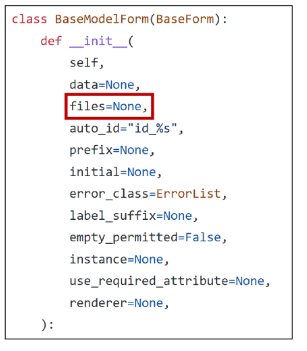

# MEDIA

# - IMAGE Upload

- Django ImageField를 사용해 `사용자가 업로드한 정적파일 관리`하기

## 1. IMAGE Field

- 이미지 업로드에 사용하는 모델 필드
- `FileField를 상속받는 서브 클래스`
- **추가기능** : 사용자에 의해 업로드된 객체가 유효한 이미지인지 검사
- ImageField 인스턴스는 `최대 길이가 100자인 문자열로 DB 생성`되며 max_length인자를 사용하여 최대 길이를 변경할 수 있음

## 2. FileField()

- FileField(upload_to=’’, storage=None, max_length=100, **options)
- 파일 업로드에 사용하는 모델필드
- 2개의 선택 인자
    1. **upload_to : 저장할 경로 지정**
    2. storage :

## 3. FileField/ImageField를 사용하기 위한 단계

1. settings.py에 `MEDIA_ROOT`, `MEDIA_URL` 설정
2. upload_to 속성을 정의하여 업로드된 파일에 사용할 MEDIA_ROOT의 하위 경로 지정

## 4. MEDIA_ROOT

- Default : ‘’(빈 문자열)
- `사용자가 업로드한 파일을 보관할 디렉토리의 절대경로`
- Django는 성능을 위해 업로드 파일은 데이터베이스에 저장하지 않음
    - `**파일 경로**를 데이터베이스에 저장`
- MEDIA_DIR은 STATIC_ROOT와 반드시 다른 경로로 지정해야 함

```python
# settings.py

MEDIA_ROOT = BASE_DIR / 'media'
```

## 5. MEDIA_URL

- Default : ‘’(빈 문자열)
- `MEDIA_ROOT에서 제공되는 미디어 파일 처리 URL`
- 업로드된 파일의 주소를 만들어주는 역할
    - 웹 서버 사용자가 사용하는 public URL
- 비어 있지 않는 값으로 설정한다면 반드시 slash로 끝나야 함
- STATIC_URL과 다른 경로로 지정해야 함

```python
MEDIA_URL = '/media/'
```

## 6. 개발 단계에서 사용자가 업로드한 미디어 파일 제공하기

```python
# crud/urls.py

from django.conf import settings
from django.conf.urls.static import static

urlpatterns = [
    # ... the rest of your URLconf goes here ...
] + static(settings.MEDIA_URL, document_root=settings.MEDIA_ROOT)
```

- 사용자로부터 업로드된 파일이 프로젝트에 업로드되고 나서 실제로 사용자에게 제공하기 위해서는 업로드된 파일의 URL이 필요함
    - 업로드된 파일의 URL = settings.py.MEDIA_URL
    - 위 URL을 통해 참조하는 파일의 실제 위치 = settings.MEDIA_ROOT

## 7. CREATE

### 7.1 imagefield 작성

```python
# articles/models.py
# Create your models here.
class Article(models.Model):
...
    image = models.ImageField(blank=True) # 없어도 된다는 뜻, 비어있더라도 is_valid에서 통과
...
```

### blank

- Default : False
- True 인 경우 Django는 빈 값을 빈 문자열로 저장
    - `문자열 기반 필드는 빈 문자열로 빈 값을 의미함`
    - 다른 필드는 null로 빈 값을 의미함

### null

- Default : False
- True인 경우 Django는 `빈 값을 DB에 Null로 저장`
    - ‘Database-related’

### null 관련 주의사항

- `“CharField, TextField와 같은 문자열 기반 필드에는 null 옵션을 사용을 피해야 함`
    - 문자열 기반필드에 null = True로 설정 시 데이터 없음에 대한 표현에 ‘빈 문자열’과 ‘null’ 2가지 모두 가능하게 됨
    - ‘데이터 없음’에 대한 표현에 두 개의 가능한 값을 갖는 것은 좋지 않음
    - `DJango는 문자열 기반 필드에서 NULL이 아닌 빈 문자열을 사용하는 것이 규칙`

### 7.2 migrations

- ImageField를 사용하려면 `Pillow 라이브러리`가 필요
    - Pillow설치 없이는 Makemigrations 실행 불가
    - `pip install Pillow`
        - 이미지 처리 기능을 제공하는 라이브러리


### 7.3 ArticleForm에서 image 필드 출력 확인

- 아직 업로드 안됨
- 파일 또는 이미지 업로드 시에는 `form 태그에 enctype 속성을 변경`해야 함

```django
# articles/create.html




  <h1>CREATE</h1>
  <form action="" method="POST" enctype="multipart/form-data">
...

```

### [참고] form 태그의 entype 속성 값(두번째꺼만 보면 됨)

1. application/x-www-form-urlencodeed
    - 기본 값
    - 모든 문자 인코딩
2. **`multipart/form-data`**
    - 파일/이미지 업로드 시에 반드시 사용해야 함
    - 전송되는 데이터의 형식을 지정
    - \<input type=”file”\>을 사용할 경우 사용
3. text/plain


### 7.4 request.FILES

- 파일 및 이미지는 request 의 POST 속성 값으로 넘어가지 않고 FILES 속성 값에 담겨 넘어감

```python
# articles/views.py

@login_required
@require_http_methods(['GET', 'POST'])
def create(request):
    if request.method == 'POST':
        form = ArticleForm(request.POST, request.FILES) 
...
    return render(request, 'articles/create.html', context)

```

- request.FILES가 두번째 위치 인자인 이유

    

### 7.5 이미지 첨부하기

- 이미지를 첨부해서  한번, 첨부하지 않고 한번 게시글 작성해보기
- 이미지를 첨부하지 않은 경우 blank=True 속성으로 인해 문자열이 저장
- 이미지를 첨부한 경우는 MEDIA_ROOT 경로에 이미지 저장
- DB에 파일 자체가 아닌 `‘경로’가 저장된다`는 것 잊지 말기 !
- 같은 이름의 파일 업로드 시, 임의의 난수 붙여서 출력


## 8. READ

### 8.1 업로드 이미지 출력하기

- 업로드된 파일의 상대 URL은 Django가 제공하는 url 속성을 통해 얻을 수 있음

```django
<!-- articles/detail.html -->





<!-- 이미지있을 때만 출력할 수 있도록 처리 -->
  
    
  
...
```

- article.image.url - 업로드 파일의 경로
- article.image - 업로드 파일의 파일 이름

## 9. UPDATE

- 바이너리 데이터이기 때문에 텍스트처럼 일부반 수정하는 건 불가능
- 새로운 이미지로 대체하는 방식을 사용!

### 9.1 업로드 이미지 수정하기

- enctype 속성값 추가하기

```django
# update.html



  <h1>UPDATE</h1>
  <form action="" method="POST" enctype="multipart/form-data">
...
```

- 이미지 파일이 담겨있는 request.FILES 추가

```python
@login_required
@require_http_methods(['GET', 'POST'])
def update(request, pk):
    article = Article.objects.get(pk=pk)
    if request.user == article.user:
        if request.method == 'POST':
            **form = ArticleForm(request.POST, request.FILES, instance=article)**
...
```

## 10. ‘upload_to’ argument

### 10.1 사용자 지정 업로드 경로와 파일 이름 설정하기

- ImageField는 업로드 디렉토리와 파일 이름을 설정하는 2가지 방법을 제공
    1. 문자열 값이나 경로 지정 방법
    2. 함수 호출 방법

### 10.1.1  문자열 값이나 경로 지정 방법

- upload_to : 인자에 `새로운 이미지 저장 경로를 추가` 후 migration 과정 진행

```python
# Create your models here.
class Article(models.Model):
...
    image = models.ImageField(blank=True, upload_to='images/')
    # image = models.ImageField(blank=True)
...
```
- 이미지 업로드하면 변경된 업로드 경로 확인


- 단순 문자열 뿐 아니라 time 모듈의 strftime()형식도 포함될 수 있음
    - 이는 파일 업로드 날짜/시간으로 대체됨

```python
# Create your models here.
class Article(models.Model):
...
    image = models.ImageField(blank=True, upload_to='%Y/%m/%d/')
    # image = models.ImageField(blank=True, upload_to='images/')
    # image = models.ImageField(blank=True)
...
```
    - 결과
    

### 10.1.2 함수 호출 방법

- **upload_to는 독특하게 함수처럼 호출이 가능하며 해당 함수가 호출되면서 반드시 2개의 인자를 받음**
    
    ```python
    def articles_image_path(instance, filename):
        return f'images/{instance.user.username}/{filename}'
    
    # Create your models here.
    class Article(models.Model):
    ...
        # image = models.ImageField(blank=True, upload_to='%Y/%m/%d/')
        # image = models.ImageField(blank=True, upload_to='images/')
        # image = models.ImageField(blank=True)
        image = models.ImageField(blank=True, upload_to=articles_image_path)
    ...
    ```
    - 결과
    
