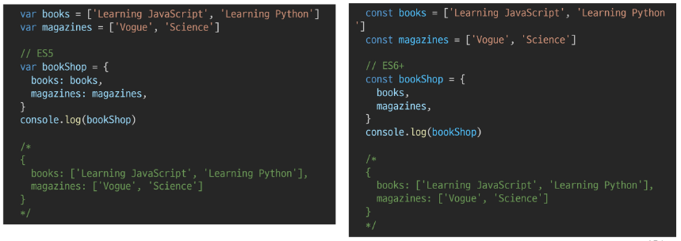
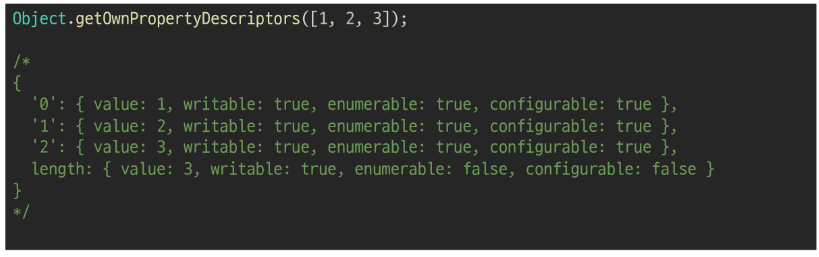

# 객체

- 속성의 집합
- 중괄호 내부에 key와 value의 쌍으로 표현
- key는 문자열 타입만 가능
    - key 이름에 띄어쓰기 등의 구분자만 있으면 따옴표로 묶어서 표현
- value는 모든 타입 가능
- 객체 요소 접근은 점(.) 또는 대괄호([])로 가능
    - key 이름에 띄어쓰기 같은 구분자가 있으면 대괄호 접근만 가능

```jsx
const myInfo = {
    name: 'jack',
    phoneNumber: '123456',
    'samsung product': {
        buds: 'Buds pro',
        galaxy:'S99',
    },
}

console.log(myInfo.name)
console.log(myInfo['name'])
console.log(myInfo['samsung product'])
console.log(myInfo['samsung product'].galaxy)

/*
ack
jack
{ buds: 'Buds pro', galaxy: 'S99' }
S99
*/
```

# ES6에 새로 도입된 문법익히기

## 1. 속성명 축약

- 객체를 정의할 때 `key와 할당하는 변수의 이름이 같으면` 예시와 같이 축약 가능



## 2. 메서드명 축약

- 메서드 선언 시 function 키워드 생략 가능

```jsx
const obj = {
    name:'jack',
/*  greeting: function () {
    } */
    greeting( ) {
        console.log('hi!')
    }
}

console.log(obj.name)
```

## 3. 계산된 속성

- 객체를 정의할 때 key의 이름을 표현식을 이용하여 동적으로 생성 가능

```jsx
const key = 'country'
const value = ['한국', '미국', '일본', '중국']

const myObj = {
    [key]: value,
}

console.log(myObj)

{ country: [ '한국', '미국', '일본', '중국' ] }
```

## 4. 구조 분해 할당

- 배열 또는 객체를 분해하여 속성을 변수에 쉽게 할당할 수 있는 문법

```jsx
const myInfo = {
    name: 'jack',
    phoneNumber: '123456',
    'samsung product': {
        buds: 'Buds pro',
        galaxy:'S99',
    },
}

const name = myInfo.name
const {name} = myInfo
const {name, phoneNumber} = myInfo
```

## 5. spread syntax(…)

- 배열과 마찬가지로 전개구문을 사용해 객체 내부에서 객체 전개 가능
- 얕은 복사에 활용 가능

```jsx
const obj = {b:2, c:3, d:4}
const newObj = {a:1, ...obj, e:5}

console.log(newObj) // {a:1, b:2, c:3, d:4, e:5}
```

## 6. JavaScriptON(JavaScript Object Notation)

- key-value형태로 이루어진 자료 표기법
- JavaScript의 object와 유사한 구조를 가지고 있지만 object는 그 자체로 타입이고, javaScriptON은 형식이 있는 문자열
- **즉, JavaScriptON을 Object로 사용하기 위해서 변환이 필요함**

```jsx
jsonData = {
    coffee: 'Americano',
    iceCream: 'Mint Choco',
}

// object -> json
const objToJson = JSON.stringify(jsonData)
console.log(objToJson) // {"coffee":"Americano","iceCream":"Mint Choco"}
console.log(typeof objToJson) // string

// json -> object
jsonToObj = JSON.parse(objToJson) // {"coffee":"Americano","iceCream":"Mint Choco"}
console.log(jsonToObj) // {"coffee":"Americano","iceCream":"Mint Choco"}
console.log(typeof jsonToObj) // object
```

### [참고] 배열은 객체다

- 키와 속성들을 담고 있는 참조 타입의 객체
- 배열은 인덱스를 키로 갖으며 length프로퍼티를 갖는 특수한 객체


