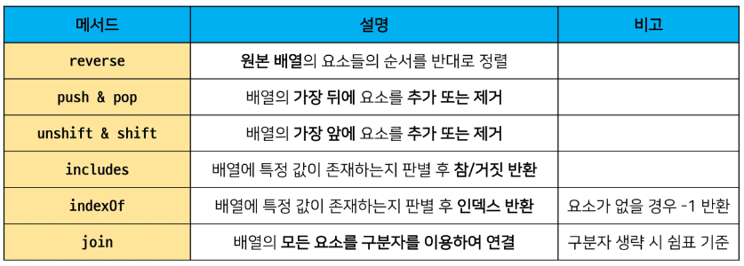

# 배열(array)

- 대괄호([])를 이용하여 생성
- `0을 포함한 양의 정수 인덱스로 특정값에 접근가능`
    - 음의 정수 불가능
- 배열의 길이는 array.length 형태로 접근 가능
    
    ```jsx
    const numbers = [1, 2, 3, 4, 5]
    console.log(numbers[0])
    console.log(numbers[-1])
    console.log(numbers[numbers.length - 1])
    
    /*
    1
    undefined
    5
    */
    ```

# 1. 배열 메서드 기초



- array.reverse()
    - 원본 배열 요소들의 순서를 반대로 정렬
    
    ```jsx
    const numbers = [1, 2, 3, 4, 5]
    numbers.reverse()
    console.log(numbers) // [5, 4, 3, 2, 1]
    ```
    
- array.push()/ array.pop()
    - 배열의 가장 뒤에 요소 추가
    - 배열의 가장 뒤에 요소 삭제
    
    ```jsx
    const numbers = [1, 2, 3, 4, 5]
    numbers.push(100)
    console.log(numbers) // [1, 2, 3, 4, 5, 100]
    numbers.pop()
    console.log(numbers) // [1, 2, 3, 4, 5]
    
    ```
    
- array.includes(value)
    - 배열에 특정 값이 존재하는지 판별 후 참 또는 거짓 반환
    
    ```jsx
    const numbers = [1, 2, 3, 4, 5]
    console.log(numbers.includes(1))   // true
    console.log(numbers.includes(100)) // false
    
    ```
    
- array.indexOf(value)
    - 배열에 특정값이 존재하는지 확인 후 가장 첫 번째로 찾은 요소의 인덱스 반환
    - 만약 해당 값이 없을 경우 -1 반환
    
    ```jsx
    const numbers = [1, 2, 3, 4, 5]
    let result
    
    result = numbers.indexOf(3)
    console.log(result)   // 2
    
    result = numbers.indexOf(100)
    console.log(result)   // -1
    
    ```
    

# 배열 메서드 심화(중요)

# 1. Array Helper Methods

- 배열을 순회하며 특정 로직을 수행하는 메서드
- 메서드 호출 시 인자로 `callback 함수`를 받는 것이 특징
- **callback 함수** : 어떤 함수의 내부에서 실행될 목적으로 인자로 넘겨받는 함수


## 1.1 forEach

- 인자로 주어지는 함수를 배열의 각 요소에 대해 한 번씩 실행
    - 콜백 함수는 3가지 매개변수로 구성
        1. element : 배열의 요소
        2. index : 배열 요소의 인덱스
        3. array : 배열 자체
- 반환 값 없음

```jsx
array.forEach(element, index, array) => {
  //
```

```jsx
// 1.
const colors = ['red', 'blue', 'green']
const printClr = function (color) {
    console.log(color)
}
colors.forEach(printClr)
```

```jsx
// 2.
colors.forEach(function (color) {
    console.log(color)
})
// 파이썬의 map과 동일
```

```jsx
// 3. 
colors.forEach((color) => {
    console.log(color)
})
```

## 1.2 map

- array.map(callback(element[,index[,array]]))
- 배열의 각 요소에 대해 콜백 함수를 한 번씩 실행
- 콜백 함수의 반환 값을 요소로 하는 새로운 배열 반환
- 기존 배열 전체를 다른 형태로 바꿀때 유용
    - `forEach + return` 이라고 생각하기

```jsx
const numbers = [1, 2, 3, 4, 5, 6]

const doubleEle = function (number) {
    return number * 2
}

const newArry = numbers.map(doubleEle)
console.log(newArry)
// [ 2, 4, 6, 8, 10, 12 ]
```

```jsx
const numbers = [1, 2, 3, 4, 5, 6]

const doubleEle = function (number) {
    return number * 2
}

const newArry = numbers.map(doubleEle)
// console.log(newArry)

const newArry = numbers.map( function (number) {
    return number * 2
})

const newArry = numbers.map((number) => {
    return number * 2
})

const newArry = numbers.map((number) => { number * 2
})

const newArry = numbers.map((number) => number * 2)
console.log(newArry)
```

## 1.3 filter

- array.filter(callback(element[, index[,array]]))
- 배열의 각 요소에 대해 콜백 함수를 한 번씩 실행
- `콜백 함수의 반환 값이 참인 요소들만 모아서 새로운 배열 반환`
- 기존 배열의 요소들을 필터링할 때 유용

```jsx
array.reduce((acc, element, index, array) => {
  // do something
}, initialvalue)
```

```jsx
const products = [
    { name: 'cucumber', type: 'vegetable'},
    { name: 'banana', type: 'fruit'},
]

// 함수 정의
const fruitFilter = function (product) {
    return product.type === 'fruit'
}

const fruits = products.filter(fruitFilter)
console.log(fruits)
// [ { name: 'banana', type: 'fruit' } ]
```

```jsx
const fruits = products.filter( function (product) {
    return product.type === 'fruit'
})
console.log(fruits)

const fruits = products.filter((product) => product.type === 'fruit')
console.log(fruits)
```

## 1.4 reduce

- array.reduce(callback[acc, element, [index[, array]])
- 인자로 주어진 함수(콜백 함수)를 배열의 각 요소에 대해 한 번씩 실행해서 하나의 결과값을 반환
- 즉, `배열을 하나의 값으로 계산하는 동작이 필요할 때 사용`(총합, 평균 등)
- map, filter 등 여러 배열 메서드 동작을 대부분 대체할 수 있음

```jsx
const numbers = [90, 80, 70, 100]

const sumNum = numbers.reduce( function (result, number) {
    return result + number
}, 0)
console.log(sumNum)

const sumNum = numbers.reduce((result, number) => {
    return result + number
}, 0)
console.log(sumNum)

const sumNum = numbers.reduce((result, number) => result + number, 0)
console.log(sumNum)
```

## 1.5 find

```jsx
array.find((element, index, array)) {

}
```

- array.find(callback[acc, element, [, index[, array]])
- 배열의 각 요소에 대해 콜백 함수를 한 번씩 실행
- 콜백 함수의 반환 값이 참이면 조건을 만족하는 첫 번째 요소를 반환
- 찾는 값이 배열에 없으면 undefined 번환

```jsx
const avengers = [
    { name: 'Tony stark', age: 45},
    { name: 'steve rogers', age: 32},
    { name: 'Thor', age: 40},
]
const avenger = avengers.find((avenger) => {
    return avenger.name === 'Tony stark'
})

console.log(avenger)
```

## 1.6 some

```jsx
array.some((element, index, array) => {
})
```

- 배열의 요소 중 `하나라도` 주어진 판별 함수를 `통과하면 참을 반환`
- `모든 요소가 통과하지 못하면 거짓 반환`
- 빈 배열은 항상 false 반환

```jsx
const arr = [1, 2, 3, 4, 5]

const result = arr.some((elem) => elem & 2 === 0) // true
```

## 1.7 every

```jsx
array.every((element, index, array) => {
})
```

- 배열의 `모든 요소가` 주어진 판별 함수를 `통과하면 참을 반환`
- `하나의 요소가 통과하지 못하면 거짓 반환`
- 빈 배열은 항상 true 반환

```jsx
const arr = [1, 2, 3, 4, 5]

const result = arr.every((elem) => elem & 2 === 0) // false
```

## 1.8 배열 순회 비교


