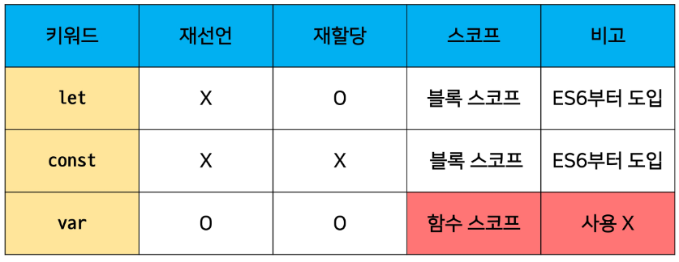
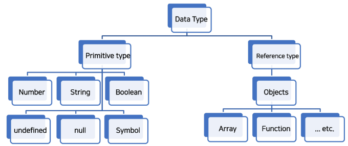

# JavaScript

- HTML 문서의 콘텐츠를 `동적으로 변경`할 수 있는 언어
- 서버 프로그래밍

# java script 실행하기

## 1. web 브라우저로 실행하기

- web browser에는 javascript를 해석할 수 있는 엔진이 있어 시행 가능
    - 브라우저의 개발자검사기 console에 출력

```python
<!DOCTYPE html>
<html lang="en">
<head>
    <meta charset="UTF-8">
    <meta http-equiv="X-UA-Compatible" content="IE=edge">
    <meta name="viewport" content="width=device-width, initial-scale=1.0">
    <title>Document</title>
</head>
<body>
    <script>
        console.log('hello javascript')
    </script>
</body>
</html>
```

- `.js` 확장자를 가진 파일에 javascript작성하고 해당 파일을 html에 포함 가능

```python
// hello.js

console.log('hello javascript')
```

```python
<!-- hello.html -->

<!DOCTYPE html>
<html lang="en">
<head>
    <meta charset="UTF-8">
    <meta http-equiv="X-UA-Compatible" content="IE=edge">
    <meta name="viewport" content="width=device-width, initial-scale=1.0">
    <title>Document</title>
</head>
<body>
    <!-- <script>
        console.log('hello javascript')
    </script> -->
</body>
<script src="hello.js"></script>
</html>
```

- 웹 브라우저의 consoldptj 바로 java script를 입력해도 됨.
    - `Vanilla Javascript`  라고 부름
    - 
    

## 2. node.js로 실행하기

- java script를 실행할 수 있음

```bash
$ node -v
$ npm -v
```

- javascript 파일 실행해보기

```bash
$ node 01_hello_.js
```

# Java script 기초 문법

# 1. 코드 작성법

## 1.1 세미콜론

- 세미콜론을 선택적으로 사용 가능
- d없으면 ASI에 의해 자동 입력됨
    - ASI(Automatic Semicolon insertion, 자동 세미콜론 삽입 규칙)
- 개념에 집중하기 위해 세미콜론 없이 진행

## 1,2 들여쓰기와 코드블럭

- python은 4칸, JS는 2칸 들여쓰기
- `블럭` 은 if, for함수에서 `{}` 내부를 말함
    - python은 들여쓰기를 이용해서 코드블럭을 구분
    - JavaScript는 중괄호를 사용해 코드블럭을 구분
    

## 1.3 코드 스타일 가이드

- 코딩 스타일의 핵심은 합의된 원칙과 일관성
- python은 `PEP8`
- JS는 `AirBnB style Guide`

## 1.4 주석

- `//` , `/* */`

# 2. 변수와 식별자

## 2.1 식별자 정의와 특징

- `식별자`는 변수를 구분할 수 있는 변수명을 말함
- 식별자는 문자, 달러($) 또는 밑줄(_)로 시작
- 대소문자를 구문하며 클래스명 외에는 모두 소문자로 작성
- 예약어 사용 불가능
- 카멜 케이스(camelCase, lower-camel-case)
    - 변수, 객체, 함수에 사용
- 파스칼 케이스(PascalCase, upper-camel-case)
    - 클래스 생성자에 사용
- 대문자 스네이크 케이스(SNAKE_CASE)
    - 상수 등 변동없는 값에 대한 정의

## 2.2 변수 선언 키워드 `(중요)`

- python과 다르게 java script는 변수를 선언하는 키워드가 정해져있음
    - 추가 동시에 값을 초기화
    1. `let`
        1. 블럭 스코프 지역변수 선언
    2. `const`
        1. 블럭 스코프 읽기 전용 상수를 선언(gjs
    3. `var`
        1. 변수 선언

- [참고] 선언 할당 초기화
    
    
- - 선언 : 변수를 생성하는 행위 및 시점
- - 할당 : 선언된 변수에 값을 저장하는 행위 또는 시점
- - 초기화 : 선언된 변수에 처음으로 값을 저장하는 행위 또는 시점

- [참고] 블록 스코프
    
    
- - 중괄호 내부를 가르킴
- 블록스코프를 가지는 변수는 블록바깥에서 접근 불가능

### 2.2.1 `let`

- 재할당 가능
- 재선언 불가능
- 블록 스코프를 갖는 지역변수를 선언
    - 선언과 동시에 원하는 값으로 초기화할 수 있음

```jsx
// let number
let number = 10 // 선언및 초기값 할당
number = 20  // 재할당 가능
```

```jsx
let number = 10 // 선언 및 초기값 할당
let number = 20 // 재선언 불가

```

- ~~chrome에서 재선언 기능 제공하긴 함~~

### 2.2.2 `const`

- 재할당 불가능
- 재선언 불가능
- 선언 시 반드시 초기값을 설정해야 함
    - 이후 값 변경 불가능
    - let과 동일하게 블록 스코프를 가짐

```jsx
// let number 불가능
const number = 10 // 선언및 초기값 할당
number = 10  // 재할당 불가능

// Uncaught TypeError: Assignment to constant variable.
//    at <anonymous>:1:8
```

```python
const number = 10 // 선언 및 초기값 할당
const number = 20 // 재선언 불가

```

- ~~chrome에서 재선언 기능 제공하긴 함~~

### 2.2.3 `var`

- 재할당 가능
- 재선언 가능
- ES6 이전에 변수를 선언할 떄 사용되던 키워드
- `호이스팅` 되는 특성으로 인해 예기치 못한 문제 발생
    - 그래서 ES6 이후 `const, let을 사용하는 것을 권장`
- 함수 스코프(function scope)를 가짐
    - `함수 선언 시 아무 변수 선언키워드를 사용하지않으면 var를 자동으로 할당함`
    

### [참고] 함수 스코프(function scope)

- 함수의 중괄호 내부를 가리킴
- 함수 스코프를 가지는 변수는 함수 바깥에서 접근 불가능
- 

### [참조] 호이스팅

- 변수를 선언 이전에 참조할 수 있는 현상
- undefined라고 출력됨
- JavaScript에서 변수는 실제 실행 시에 코드의 최상단으로 끌어 올려지게 됨(hoisted)

```jsx
console.log(name) // undefined 선언 이전에 참조
var name = '홍길동' // 선언

// JS는 위코드를 암묵적으로 아래와 같이 이해함
var name
console.log(name) // undefined) 선언 이전에 참조
var name = '홍길동' // 선언
```

## 변수 선언 키워드 정리

- Airbnb 스타일 가이드는 기본적으로 `const` 사용을 권장
    - 재할당해야 하는 경우만 `let`
- 실습할 떈 편의를 위해 재할당이 가능한 `let` 을 기본적으로 사용해도 됨



# 3. 데이터 타입

- jS는 모든 값은 특정 데이터 타입을 가짐
- 크게 원시타입(Primary type)과 참조타입(Reference type)으로 분류됨



## 3.1 Number

- 정수 또는 실수형 숫자를 표현하는 자료형

```jsx
const a = 13
const a = 13
```

- NaN(Not a Number)를 반환하는 경우
    1. 숫자로서 읽을 수 없음
    2. 결과가 허수인 수학 계산식
    3. 피연산자가 NaN
    4. 정의할 수 없는 계산식 ( 0 * Infinity)
    5. 문자열을 포함하면서 덧셈이 아닌 계산식
- `isNaN()`
    - number.isNaN() 주어진 값의 휴형이 Number이고 NaN이면 true
    - 아니면 false

## 3.2 String

- 문자열을 표현하는 자료형
- 작은 따옴표 또는 큰 따옴표 모두 가능
- `덧셈`을 통해 더 할 수 있음

### Template Literal

- 줄바꿈이 되며, 문자열 사이에 변수도 삽입 가능
- 백탭 내에 `${expression}`

```jsx
const word2 = `안녕`
const message = `홍길동 ${word2}`
```

## 3.3 Empty Value

- 값이 존재하지 않음을 표현하는 값
    - `null`, `undefined`가 존재
    - interchangable하게 사용하기

### null

- 값이 없음을 의도적으로 표현할 때
- 

### undefined

- 직접 값을 할당하지 않으면 자동으로 할당

### null과 undefined

- 차이점은 typeof 연산자를 통해 타입을 확인헀을때 나타남

```jsx
typeof null // "object"
typeof undefind // "undefined"
```

- 설계상 오류
- `하지만 참조타입임을 주의`

## 3.4 Bolean

- true, false
- `자동 형변환 규칙`

# 연산자

## 1. increment decrement

## 2. 비교연산자

- 내부 유니코드를 기준으로 비교

## 3. 동등 연산자(`==`)

- 비교할 떄 `암묵적 타입 변환을 통해 타입을 일치시킨 후`  같은 값인지 비교a

```jsx
const a = 1
const b = '1'
console.log(a == b) // True
```

## 4. 일치 연산자(===)

- 비교할 떄 `암묵적 타입 변환하지 않고 `타입과 같은 값인지 비교`

```jsx
const a = 1
const b = '1'
console.log(a == b) // False
```

## 5. 논리연산자

- && : and
- || : or
- ! : not

## 6. 삼항 연산자(ternary operator)

- 3개의 피연산자를 사용하여 조건에 따라 값을 반환하는 연산자
- 가장 앞 조건식이 참이면 : 앞의 값을 반환 False면 뒤에 값 반환

```jsx
True ? 1: 2 // 1 
```

# 조건문

## 1. if statement

- if, else if, else
- 조건 표현식의 결과값을 boolean타입으로 변환 후 참/거짓을 판단

```jsx
const name = 'manager'

if (name === 'admin') {
  console.log('관리자')
} else if (name === 'manager') {
  console.log('매니저')
} else {
  console.log(`${name}`)
}

```

## 2. switch statement

- 조건 표현식의 결과값이 어느 값(case)에 해당하는지 판별
- (Fall through 발생)

```jsx
const name = 'manager'

switch (name) {
  case 'admin': {
  console.log('관리자')
  break
} case 'manager' {
  console.log('매니저')
  break
} default: {
  console.log(`${name}`)
}

```

# 반복문

1. while
2. for
3. for in
4. for of

## 1. while

```jsx
let i = 0
while (i < 6) {
  console.log(i)
  i += 1
}
```

## 2. for

```jsx
for ([초기문]; [조건문]; [증감문]) {

}
// 예시
for (let i = 0; i < 6; i++) {
  console.log(i)
}
```

## 3. for in

- 객체 속성을 순회할 때
- `배열도 순회가능하지만 인덱스 순으로 순회한다는 보장 없음`

```jsx
for (variable in object) {
  statement
}
```

## 4. for of

- 반복 가능한 객체를 순회할 때 사용
- Array, Set, String

```jsx
for (variable of numbers) {
  statements
}
```

## for in, for of 차이점

```jsx
const arr = [3, 5, 7]

for (const i in arr) {
  console.log(i)
}
// 0, 1, 2

for (const i of arr) {
  console.log(i)
}
// 3, 5, 7
```

- [참고] `for in`, `for of`는 재할당이 아니라 매 반복 시 변수를 새로 정의하여 사용하므로 const 사용해도 에러 발생하지 않음
    