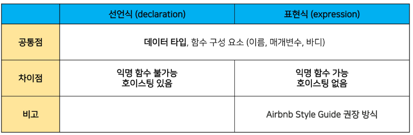

# 함수

- 참조 타입 중 하나로써 function 타입에 속함
- JavaScript에서 함수를 정의하는 방법
    - 함수 선언식
    - 함수 표현식

## 1. 함수선언식

- 일반적 반식

```jsx
function 함수명() {
  // do something
}
```

```jsx
function add(num1, num2) {
    return num1 + num2
}
```

```jsx
function add(num1, num2) {
    return num1 + num2
}

console.log(add(2, 7))
```

## 2. 함수 표현식

- 표현식 내에 함수를 정의하는 방법
- 함수의 이름을 생략한 익명함수로 정의

```jsx
변수키워드 함수명 = function add(num1, num2) {
    return num1 + num2
}
```

```jsx
console.log(add(2, 7))
const sub = function (num1, num2) {
    return num1 - num2
}
console.log(sub(7, 2)) // 5
```

- 표현식에서 함수 이름을 명시하는 것도 가능
- 호출에는 사용하지 못하고 디버깅 용도로 사용됨

```jsx
console.log(add(2, 7))
const mySub = function namedSub(num1, num2) {
    return num1 - num2
}
console.log(mySub(7, 2)) // 5
namedSub(1, 2)
```

## 3. 기본 인자(Default arguments)

- 인자 작성 시 ‘=’ 문자 뒤 기본 인자 선언 가능

```jsx
const greeting = function (name = 'Anonymous') {
  return `Hi ${name}`
}
greeting() // Hi Anonymous
```

### 매개변수와 인자의 개수 불일치 허용

- 매개변수보다 인자의 개수가 많을 경우

```jsx
const noArgs = function () {
  return 0
}
noArgs(1, 2, 3) // 0

const twoArgs = function (arg1, arg2) {
  return [arg1, arg2]
}
twoArgs(1, 2, 3) // [1, 2]

const twoArgs = function (arg1, arg2, arg3) {
  return [arg1, arg2, arg3]
}
twoArgs(1) // [1, undefined, undefined]
```

## 4. spread syntax(…)

- “전개 구문”
- 전개 구문을 사용하면 배열이나 문자열과 같이 반복 가능한 객체를 배열의 경우는 요소, 함수의 경우는 인자로 확장할 수 있음
    1. 배열과의 사용
    2. 함수와의 사용(Rest parameters)
- 배열과의 사용

```jsx
let parts = ['shoulders', 'knees']
let lyrics = ['head', ...parts, 'and', 'toes']
//  ['head', 'shoulders', 'knees', 'and', 'toes']
```

- 함수와의 사용(Rest Parameter)
    - 정해지지 않은 수의 매개변수를 배열로 받을 수 있음
    
    ```jsx
    function func(a, b, ...theArgs) {
      //
    }
    ```
    
    ```jsx
    const resOpr = function (arg1, arg2, ...restArgs) {
      return [arg1, arg2, restArgs]
    }
    restArgs(1, 2, 3, 4, 5) // [1, 2, [3, 4, 5]]
    ```
    

## 5. 선언식과 표현식

### 5.1 함수의 타입



## 6. Arrow Function

- 함수를 비교적 간결하게 정의할 수 있는 문법
- 표현식에서만 사용 가능_순서대로 진행해야 함_**1단계는 필수**
    1. **function 키워드 생략 가능** 
    2. **함수의 매개변수가 하나뿐이라면 `()` 도  생략 가능**
    3. **함수의 내용이 한줄이라면 `{}`,와 `return`도 생략 가능**
- 화살표 함수는 항상 익명 함수
    - == 함수 표현식에서만 사용 가능
    
    ```jsx
    //화살표 함수 예시
    const arrow1 = function (name) {
        return `hello ${name}`
    }
    
    // 1. function 키워드 삭제
    const arrow2 = (name) => {
        return `hello ${name}`
    }
    
    // 2. 인자가 1일 때 () 생략
    const arrow3 = name => {
        return `hello ${name}`
    }
    
    // 3. 함수 바디가 return을 포함한 표현식 1개일 경우에 {} & return 삭제 가능
    const arrow4 = name => `hello ${name}`
    ```
    
- 화살표 함수 응용(객체 반환 시)
    
    ```jsx
    // 1. 인자가 없다면? () or _로 표시 가능.
    let noArgs = () => 'No args'
    noArgs = _ => 'No args'
    
    // 2-1 object를 return 한다면
    let returnobject = () => { return { key: 'value' } } // return을 명시적으로 적어준다
    
    // 2-2 return을 적지 않으려면 괄호를 붙여야 한다.
    returnObject = () => ({ key: 'value' })
    ```
    

## 6.1 즉시 실행 함수(IIFE, Immediately Invoked Function Expression)

- 선언과 동시에 실행되는 함수
- 함수의 선언 끝에 `()` 를 추가하여 선언되자마자 실행하는 형태
- `()` 에 값을 넣어 인자로 넘겨줄 수 있음
- 즉시 실행 함수는 선언과 동시에 실행되기 때문에 같은 함수를 다시 호출할 수 없음
- 이러한 특징을 살려 초기화 부분에 많이 사용
- 일회성 함수이므로 익명함수로 사용하는 것이 일반적

```jsx
(function (num) { return num ** 3 })(2) // 8
(num => num ** 3)(2) // 8
```